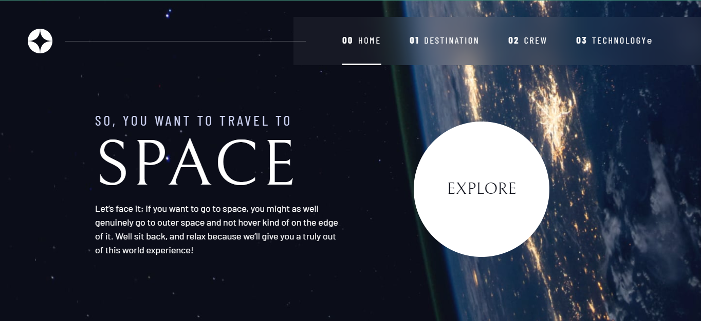

<!--Markdown language practical-->

### First Heading

<br>

# Mohammad iqbal hossain

<br>

### pragraph

<br>

<p>This is my github profile,<br> ANd i am doing intermediate now,<br> It;s really important for me! thanks a lot</p>

This is a normal text!

<br>

### horizontal line
----  ---
<br>

### itallic text
_This is a italic text_

### Bold text

__This is a strong text__

### strighthrough text

~~This is a strickthrough text~~

<br>

### Inline code
`this is inline`  
`<h1>Bangladesh</h1>` 

### Multiple line code

<br>

```html
<html>
      <head>
          <title>Document</title>
      </head>
      <body>
          <h1>I am iqbal</h1>
      </body>
</html>
 
```

```javascript
console.log("Hello world")
```

```css
.file {
    background: #97509b;
    font-size: 3px;
    font-style: none;
    display: visible;
    width: 30vh;
    margin: 10px 40px;
}
```

### ordered list 

1. Item1
2. Item1
   1. item2.1
   2. item2.2
   3. item2.3
3. Item1
4. Item1
5. Item1


### Unordered list 

- item1
- item2
    - item1.2
- item3
    - item1.3

<br>

 ### Task list


 <br>


- [x] item1
- [x] item2
    - [x] item1.2
- [x] item3
    - [x] item1.3


<br>

 ### Automatic link

 http://www.studywithanish.com

<br>

 ### disaled link

`http://www.studywithanish.com`

<br>

### Markdown link syntax

[iqbalhossain](http://www.studywithanish.com)

<br>

### Markdown link syntax

 [websitelink] [studywithanish]
 [facebook] [twitter]

<!--ALL link is here-->
[websitelink]: http://www.studywithanish.com
[studywithanish]: http://www.studywithanish.com
[facebook]: http://www.studywithanish.com
[twitter]:  http://www.studywithanish.com

<br>

### Image show


😀

<!--  -->

### Table making 

<br>

| Name | Email | status |
| ---- | ----- | ----- |
| Iqbal | mdiqbalhossain5170@gmail.com | Avilabe |
| Iqbal | iqbalhossain51704@gmail.com | Avilable |


  


